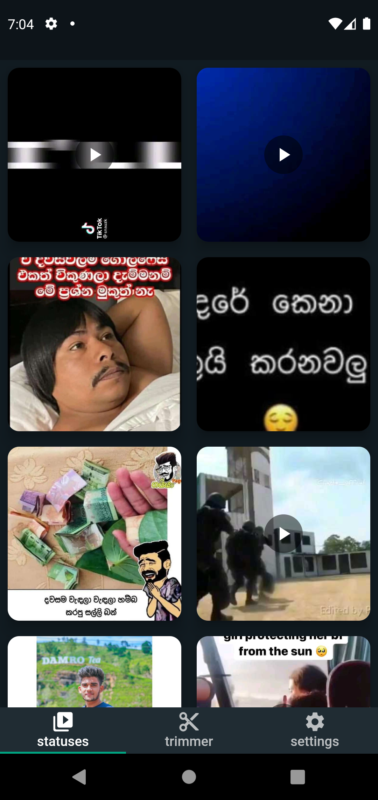
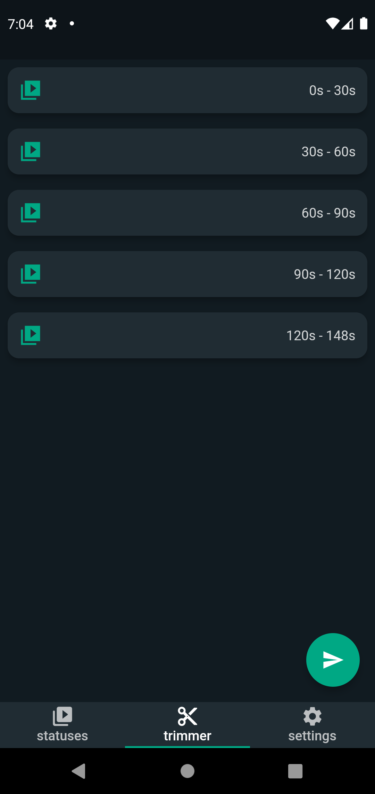
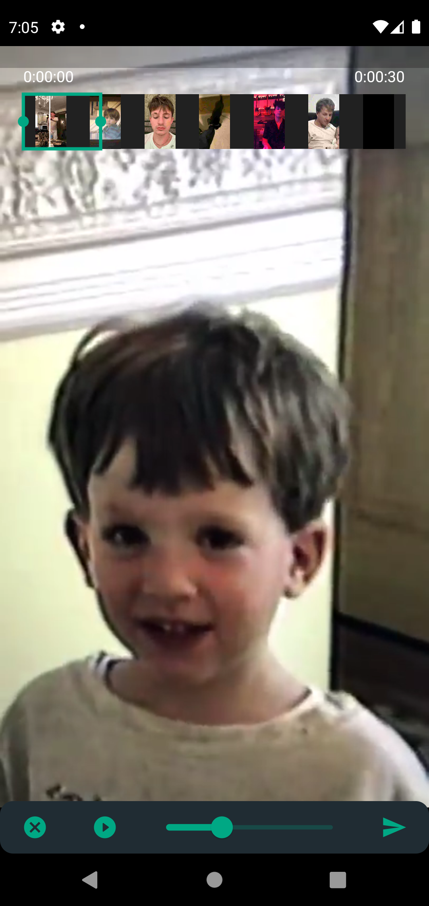
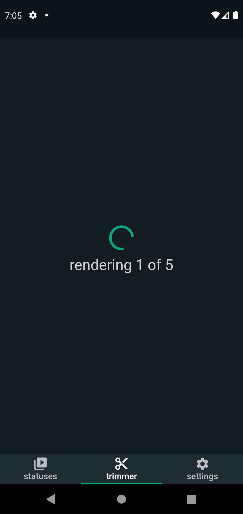
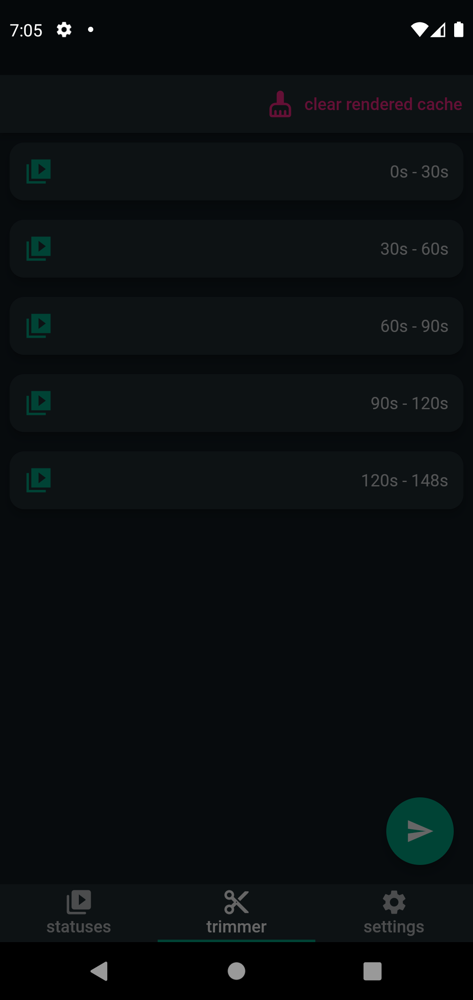
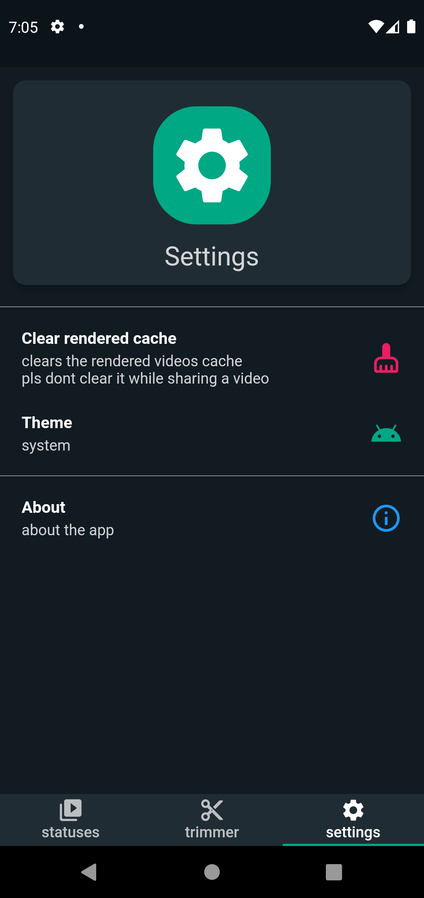
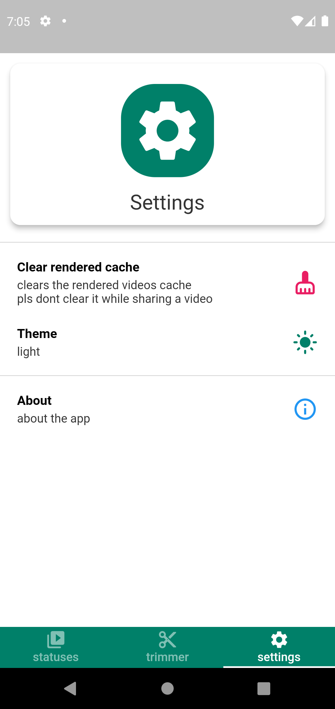
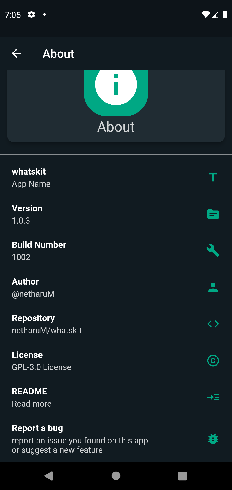

# whatskit


a toolkit for whatsapp including

- whatsapp status downloader
- auto trimmer
  - it automatically trims the video to 30 sec clips so you don't have to trim the video into multiple 30 second parts
  - this renders the video clips when sharing
  - make sure to clear the ```rendered cache``` by clicking the "clear rendered cache" button in the trimmer page
    - this button is hidden until videos are rendered
    - and this button disappears when you reopen the app
    - in that case pls go to settings and clear the cache
    - rendered video clips are saved in ```/storage/emulated/0/android/data/com.netharuM.whatskit/files/Trimmer/```

images

- statuses page
  - you can see all the statuses you have here and also download them
  - 

- trimmer page
  - you can trim videos that are longer than 30 seconds to 30 second clips by doing this it is easier for you to share your videos rather than manually trimming videos into 30 second parts in whatsapp
  - 

- trim editor
  - you can additionally change the automatically trimmed video as you prefer in here
  - 

- trim rendering page
  - this page will show you progress of the rendering clips
  - 

- sharing page
  - you will get a share option to share the videos you have clipped
  - you can chose whatsapp there and share as a whatsapp status
  - 

- settings page
  - with an option to clear the rendered cache incase you forogot to clear it
  - and themes
    - dark theme
      - 
    - light theme
      - 
- about page
  - 
